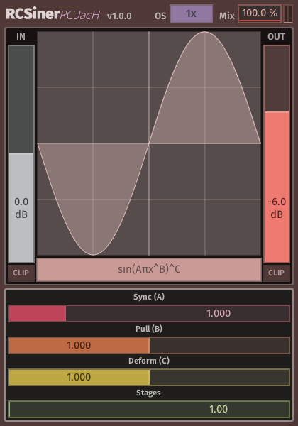
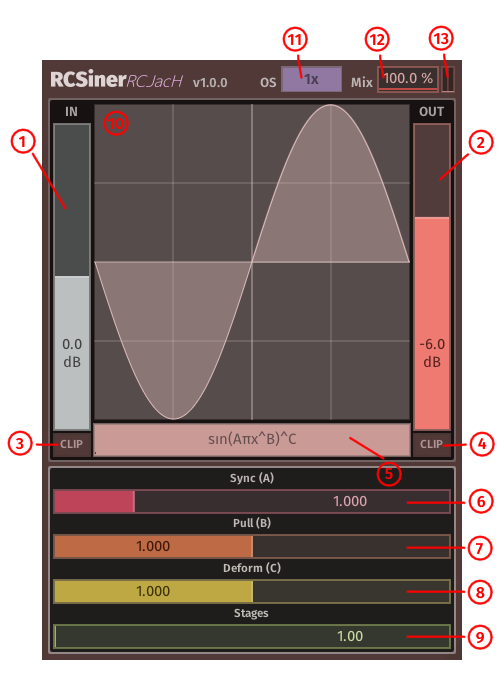

# RCSiner

## Introduction

RCSiner is an audio plugin that employs phase-distortion and waveshaping techniques utilizing the sine function.
It provides a collection of selectable formulas, each equipped with three adjustable parameters and the capability to transform through multiple processing stages.
This versatile tool offers and extensive range of sonic possibilities, from subtle harmonic saturation to full-on destruction of the audio signal.

## Disclaimer

This plugin is delivered as is, with no guarantees for future updates or support.
Since it has only been briefly tested, use it at your own risk, and be sure to test it in your workflow before relying on it for critical projects.
Feedback is welcomed, but there are no promises for feature requests or changes.

## Installation

This plugin is portable and requires no installation. To set it up, simply drag the files to their corresponding plugin directories:

- **CLAP**: Place the `RCSiner.clap` in the CLAP plugin folder (e.g., `C:\Program Files\Common Files\CLAP` on Windows or `~/Library/Audio/Plug-Ins/CLAP` on macOS).
- **VST3**: Place the `RCSiner.vst3` in the VST3 folder (e.g., `C:\Program Files\Common Files\VST3` on Windows or `~/Library/Audio/Plug-Ins/VST3` on macOS).

After copying the files, restart or refresh your DAW to ensure it recognizes the new plugin formats.

## Warning

This plugin can produce extremely loud audio signals when the input exceeds 0dB.
To prevent hearing damage or breaking equipments, ensure either to reduce the output volume or activate output clipping.
Both features are provided by this plugin.

## Controls

- **Sliders**:
  - **Left double-click**: Resets the slider to its default value.
  - **Left press and drag**: Adjusts the handle from its current position.
  - **Ctrl + drag**: Adjusts the parameter in steps.
  - **Shift + drag**: Fine-tunes the adjustment.
  - **Alt + left click**: Moves the handle to the current mouse position.
- **Buttons**:
  - **Left click**: Switches between different button values.
  - **Ctrl + left click** Resets the button to its default value.

## Parameters

1. **Input Gain**: Adjusts the volume of signal *before* applying the waveshaping algorithm (also known as `drive`).
2. **Output Gain**: Adjust the volume of signal *after* the waveshaping algorithm. (also known as `make-up gain`).
3. **Input Clip**: Clips the input signal at 0dB, applied *after* the `Input Gain`.
4. **Output Clip**: Clips the output signal at 0dB, applied *before* the `Output Gain`.
5. **Algorithm Selection**: Choose which algorithm to apply. Left click or left drag to switch algorithms. Left double-click to reset to default. Right click shows all available options.

> The actual implementation of algorithms are slightly different due to decimal exponent on a negative number returns imaginary number.

6. **Sync (A)**: Controls the rate of the sine wave.
7. **Pull (B)**: Pulls the sine wave towards the center (0 on the x axis) when the value is below 1, or towards +-1 when the value is above 1.
8. **Deform (C)**: Modifies the sine wave's thickness. Values below 1 makes the wave fatter; values above 1 thin it.
9. **Stages**: The number of signal processing stages, interpolated. Equivalent to inserting multiple plugin instances with the same settings.
10. **Waveform Display**: Visualizes the algorithm's effect on a sawtooth wave. Use the mouse wheel to zoom in/out, and left double-click resets the view. Grid lines at half-integers are visually less prominent.
11. **Oversample Settings**: Toggles oversampling to reduce aliasing. Right click for more settings, including separate ratios for real-time playback and rendering.
12. **Mix**: Control the balance between dry and wet signals. 0% uses only dry; 100% only wet.
13. **Output Meter**: Visual guide to output volume, aiding in avoiding clipping.
